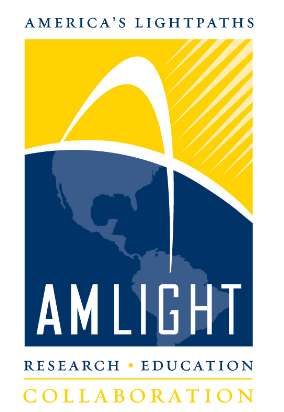

# AmLight Academic Reading Group Agenda

## Articles

Meeting Date (UTC) |  Article Title | Chair
--- | --- | ---
May 05, 2018 at 8PM | Yang, X., Han, B., Sun, Z., and Huang, J. (2017). SDN-based DDoS Attack Detection with Cross-Plane Collaboration and Lightweight Flow Monitoring. GLOBECOM. | Italo Valcy

## About

Visit [amlight.net](https://www.amlight.net/) for more information.

